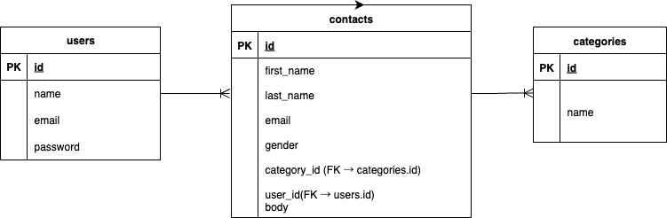

# FashionablyLate

## 環境構築

### Docker ビルド

1. git clone https://github.com/shiroyama373/FashionablyLate.git
2. docker-compose up -d

※ MySQL は OS によって起動しない場合があります。docker-compose.yml を環境に合わせて調整してください。

### Laravel 環境構築

1. docker-compose exec php composer install
2. composer install
3. .env.example をコピーして .env を作成し、環境変数を変更
   - DB_DATABASE、DB_USERNAME、DB_PASSWORD は docker-compose.yml の値に変更
4. php artisan key:generate
5. php artisan migrate
6. php artisan db:seed
   - ログインに必要なデータは database/seeders/UsersTableSeeder.php に記載
7. php artisan storage:link

## 使用技術

- PHP 8.3
- Laravel 10
- MySQL 8.x
- mailhog（開発用メール確認ツール）
- phpMyAdmin（MySQL 管理ツール）

## URL

- 開発環境：http://localhost
- phpMyAdmin：http://localhost:8080

## ER図

## 変更・注意点

- Dockerfile を PHP 8.3 に更新
- Laravel 10 に対応
- MySQL の TLS/SSL エラー回避のため ssl-mode=DISABLED を設定
- フォームの GET → POST 問題を修正

- ダミーデータ（categories, users）を db:seed で投入済み